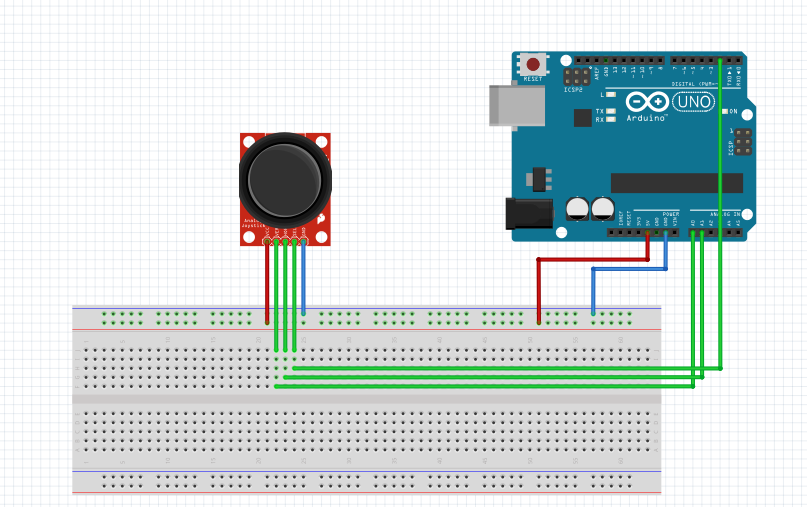

# Arduino joystick

This is a simple program for read value of a joystick with an Arduino. It uses an arduino joystick and arduino uno.

## Setup



Function `getValue` returns the position of the joystick :

```txt
UP: 1
DOWN: 2
LEFT: 4
RIGHT: 8
```
